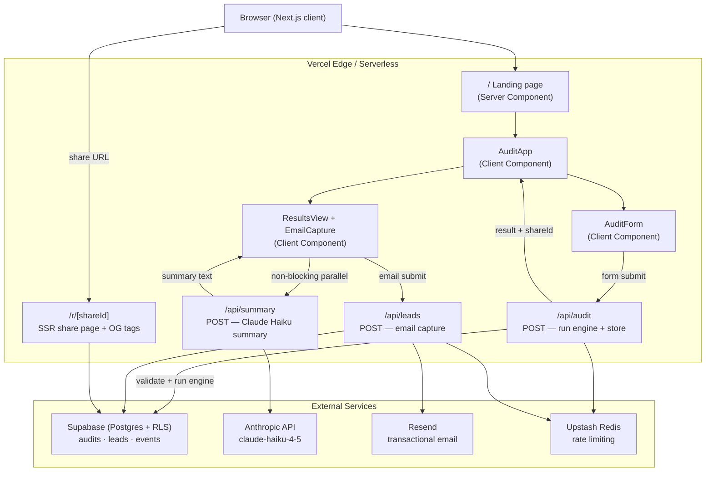

# ARCHITECTURE.md — System Architecture

## System diagram



---

## Component breakdown

### Client components

| Component | File | Responsibility |
|---|---|---|
| `AuditApp` | `src/components/audit/AuditApp.tsx` | State machine: form → loading → results |
| `AuditForm` | `src/components/audit/AuditForm.tsx` | React Hook Form + Zod, dynamic tool cards, localStorage persistence |
| `ResultsView` | `src/components/audit/ResultsView.tsx` | Savings hero, recommendation cards, email capture, share button |
| `EmailCapture` | inside ResultsView | Honeypot field, POST to /api/leads, loading/done/error states |
| `ShareResultsView` | `src/components/audit/ShareResultsView.tsx` | Read-only PII-free results for share URL |

### API routes (Next.js App Router)

| Route | Method | Purpose |
|---|---|---|
| `/api/audit` | POST | Zod validate → run engine → Supabase insert → return `{result, shareId}` |
| `/api/summary` | POST | Claude Haiku summary → deterministic fallback if no key |
| `/api/leads` | POST | Honeypot check → Supabase leads insert → Resend email |

### Core library

| Module | File | Responsibility |
|---|---|---|
| `AuditEngine` | `src/lib/audit/engine.ts` | Pure function: `run(input) → AuditResult`. 5 rules, deterministic. |
| `pricing` | `src/lib/audit/pricing.ts` | All vendor/tier/price constants with source URLs |
| `schema` | `src/lib/audit/schema.ts` | Zod v4 schema matching `AuditInput` |
| `vendors` | `src/lib/audit/vendors.ts` | Dropdown metadata for form |
| `types` | `src/lib/audit/types.ts` | TypeScript types: AuditInput, AuditResult, Recommendation |
| `rate-limit` | `src/lib/rate-limit.ts` | Sliding-window rate limiter over Upstash Redis REST |
| `supabase/client` | `src/lib/supabase/client.ts` | Returns `null` when env vars absent — graceful no-op |

---

## Key architectural decisions

### 1. Deterministic engine, not LLM-generated recommendations

The audit rules are pure TypeScript functions — no LLM involved in generating recommendations. This was a deliberate choice:

- **Trustworthiness:** Every recommendation has a `sourceUrl` to live vendor pricing. An LLM could hallucinate prices or fabricate recommendations.
- **Latency:** The engine runs in <10ms vs 1–3s for a Claude call.
- **Cost:** Zero marginal cost per audit at scale.
- **Testability:** 24 unit tests cover every rule. LLM outputs can't be tested this way.

Claude is used only for the *narrative summary* — a 100-word prose paragraph that wraps deterministic data. If Claude fails, a templated fallback kicks in.

### 2. Graceful degradation without credentials

Every external dependency is optional:
- No Supabase → audit works, no storage
- No Anthropic key → audit works, templated summary
- No Resend key → email capture works, no confirmation email
- No Upstash → rate limiting is allow-all

This lets the app run fully end-to-end in development with zero external accounts.

### 3. SSR share page with OG metadata

`/r/[shareId]` uses Next.js `generateMetadata` to fetch the audit from Supabase server-side and embed the savings number directly in the OG title. No client JS required for social card rendering — the OG image reads "I found $640/mo in savings" from actual DB data.

### 4. Non-blocking AI summary

The AI summary is fetched in a fire-and-forget parallel request after the audit result renders. The results page is immediately useful without waiting for Claude. The summary fades in when ready. This eliminates 1–3 seconds of perceived latency for the primary user experience.

### 5. Zod v4 + react-hook-form compatibility

Zod v4 changed `z.coerce.number()` to infer `unknown` instead of `number` as the schema output type. This broke `@hookform/resolvers`' type matching. Fix: use `z.number()` directly + `valueAsNumber: true` on `<input>` elements — react-hook-form coerces the string to a number before passing to the resolver, so Zod sees a real number.

---

## Data model

### `audits` table
```sql
id          uuid PRIMARY KEY          -- shareId, client-generated
input       jsonb NOT NULL            -- AuditInput (tools, teamSize, useCase)
result      jsonb NOT NULL            -- AuditResult (recommendations, totals)
email       text                      -- set after email capture
created_at  timestamptz DEFAULT now()
```

### `leads` table
```sql
id              uuid PRIMARY KEY DEFAULT gen_random_uuid()
audit_id        uuid REFERENCES audits(id)
email           text NOT NULL
monthly_savings numeric
show_credex_cta boolean DEFAULT false
created_at      timestamptz DEFAULT now()
```

### `events` table
```sql
id          uuid PRIMARY KEY DEFAULT gen_random_uuid()
audit_id    uuid REFERENCES audits(id)
event       text NOT NULL    -- audit_completed | email_captured | share_clicked
meta        jsonb
created_at  timestamptz DEFAULT now()
```

### RLS policies
- Public: read single audit by id (share URL). Cannot enumerate.
- Leads and events: insert-only from app, no public read (PII).

---

## Audit engine — rule execution order

Rules run in priority order. The first firing rule for a given tool wins.

1. **Use-case fit** — wrong tool category entirely (e.g., ChatGPT for pure coding) → `switch_vendor`
2. **API vs. subscription** — developer paying per-seat when API access is cheaper → `switch_vendor`
3. **Plan fit** — on a tier with more capacity than needed → `downgrade`
4. **Redundancy** — two coding tools running in parallel → `consolidate`
5. **Credex CTA threshold** — if total savings > $500/mo → set `showCredexCta: true`

Order matters: "switch vendor" is always a bigger win than "downgrade within vendor" — so use-case fit runs before plan fit.

---

## Tech stack

| Layer | Choice | Reason |
|---|---|---|
| Framework | Next.js 15 (App Router) | SSR for OG tags; API routes; TypeScript-native |
| Language | TypeScript (strict) | Type safety across form → engine → API boundary |
| UI | shadcn/ui + Tailwind CSS | Accessible components, no runtime CSS-in-JS cost |
| Forms | react-hook-form + Zod v4 | Validated form output passes directly to engine |
| Database | Supabase (Postgres + RLS) | Row-level security; public share URL without service key |
| Email | Resend | Best-in-class deliverability; simple REST API |
| Rate limiting | Upstash Redis | Serverless-compatible; pay-per-use |
| AI | Anthropic claude-haiku-4-5 | Fast, cheap, sufficient for 100-word summary |
| Testing | Vitest | Native ESM, fast, TypeScript-first |
| Hosting | Vercel | Zero-config Next.js deployment |
